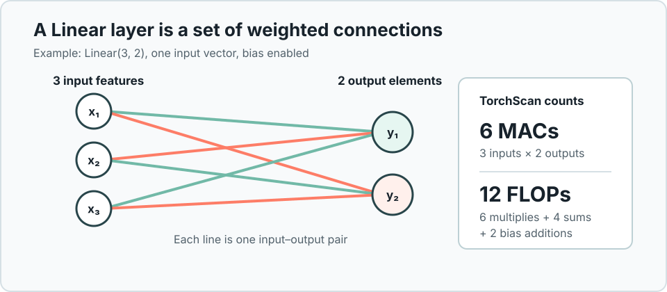
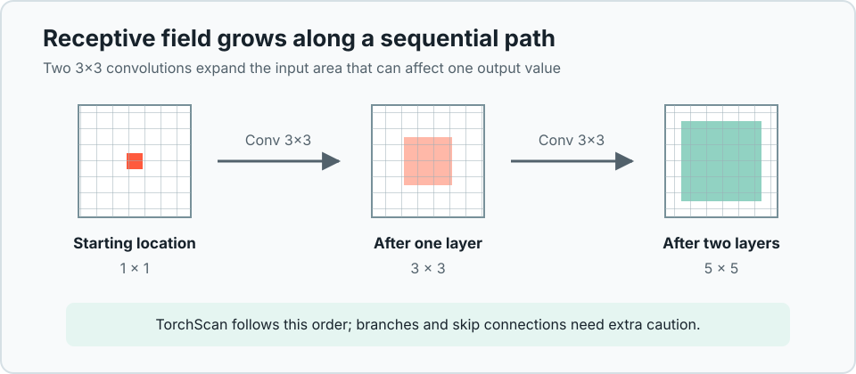

# Understanding results

TorchScan estimates model cost from a synthetic forward pass with a batch size of one. The numbers describe that pass; they are not hardware benchmarks.

## Parameters and model size

Parameter and buffer counts come from the tensors registered on the model. Model size is their storage size, not the peak memory required to execute the model.

## FLOPs

FLOPs are floating-point operations performed during the forward pass. They are not FLOP/s, which is a throughput measurement. TorchScan uses formulas for recognized module types, so totals can omit unsupported or functional operations.

## MACs

A MAC is a multiply-accumulate operation. For a Linear layer, TorchScan counts:

```text
input features × number of output elements
```

Bias additions and activation functions affect FLOP counts separately; they do not turn each Linear output into one MAC.

[](img/linear-counts.svg)

For `Linear(3, 2)` on one input vector, TorchScan reports 6 MACs and 12 FLOPs when bias is enabled: 6 multiplications, 4 additions to form the two sums, and 2 bias additions.

## DMAs

DMAs are modeled direct memory accesses for recognized operations. They estimate data movement from tensor shapes and module parameters; they do not measure memory bandwidth, cache behavior, or latency.

## GPU memory

GPU memory values are process- and allocator-level snapshots around the synthetic forward pass. They do not isolate the model from framework initialization, caching, other processes, or all devices.

Small models and multi-GPU environments can produce noisy or even negative overhead deltas. A negative value does not mean the model uses negative memory; treat it as an unreliable measurement and include the full environment when reporting it.

## Receptive field

Receptive-field values are accumulated in module execution order. This works for sequential paths, including dilation, but does not model branch topology. Residual and other skip-connected architectures can therefore produce inaccurate values.

[](img/receptive-field.svg)

## Troubleshooting

> **Unexpected zero totals:** Check for unsupported leaf modules, `torch.nn.functional` calls, tensor methods, or Python operators. These operations are not observed by module hooks.

> **Negative RAM overhead:** Treat the value as measurement noise, especially for small models or multi-GPU processes. Parameter and buffer size remains separate from this estimate.

> **`TypeError` involving an output path:** A hooked output contains an unsupported leaf or no tensor. Tuple, list, and dictionary outputs are supported when their leaves are tensors or `None`.

> **Data-dependent inputs:** Inputs generated from `input_shape` are independent random tensors. Use `input_data` for correlated, masked, integer, or otherwise caller-defined tensors.

See [Model and input support](model-support.md) for the complete compatibility contract and the [package reference](torchscan.md) for API details.
